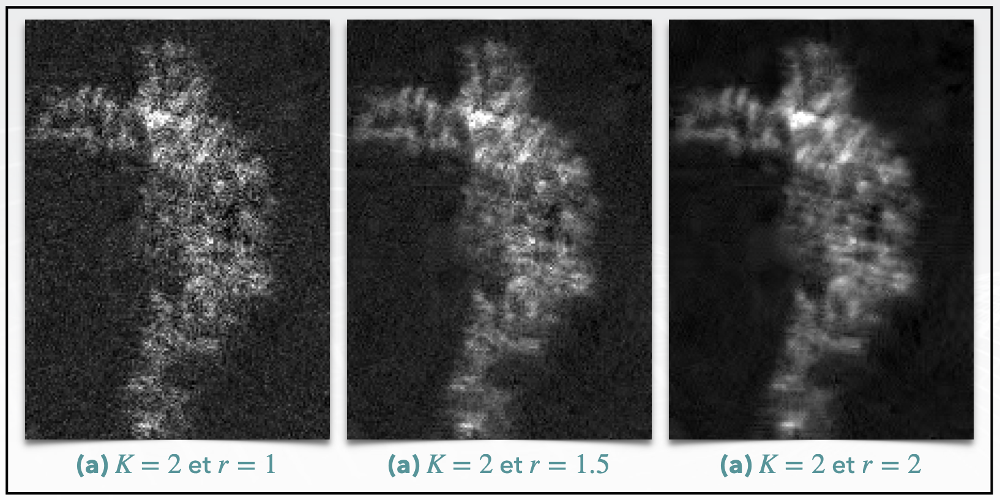
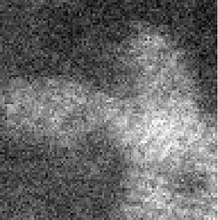
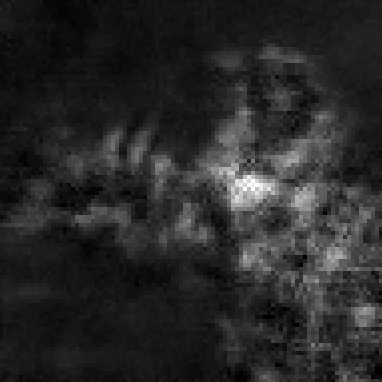
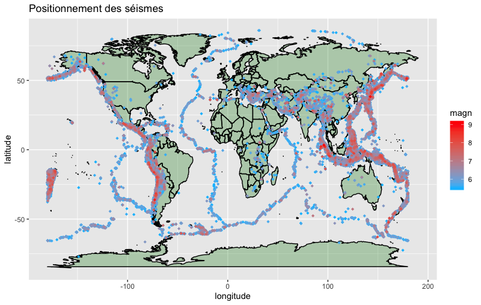
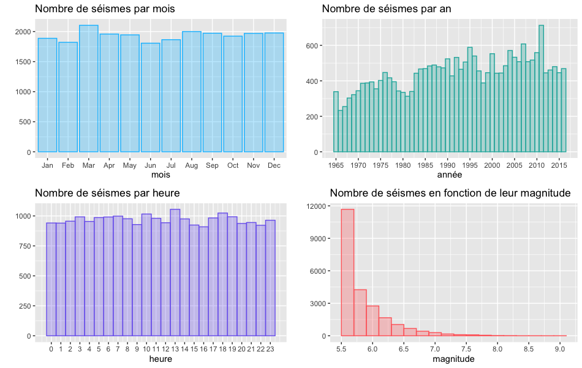
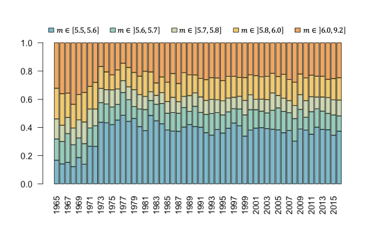
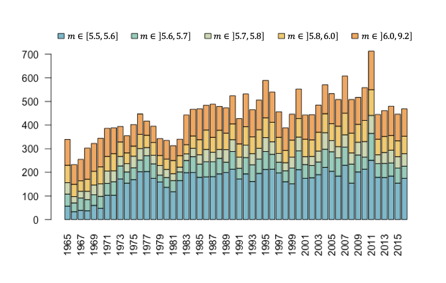
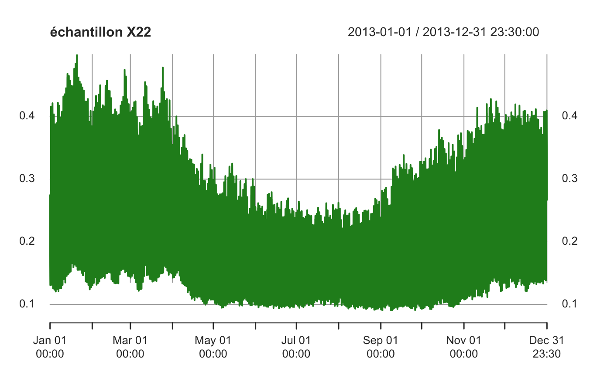

**PhD thesis**

***

**Atomic-scale denoising of hyperspectral imaging**

***

**Hackathon Open Data DGFiP 2022**

***

**Earthquake prediction**

***

**Kaggle competition to predict electricity consumption**

***
